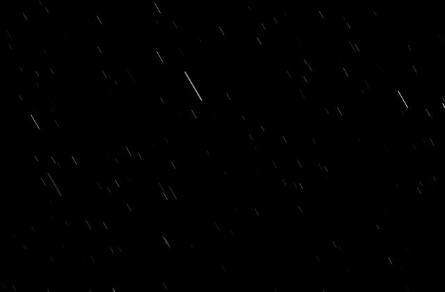
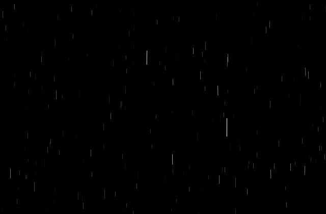
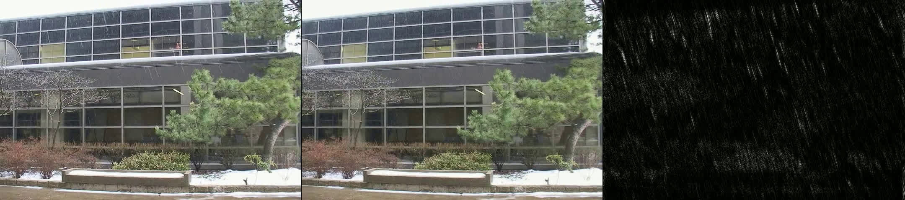
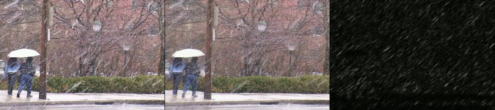
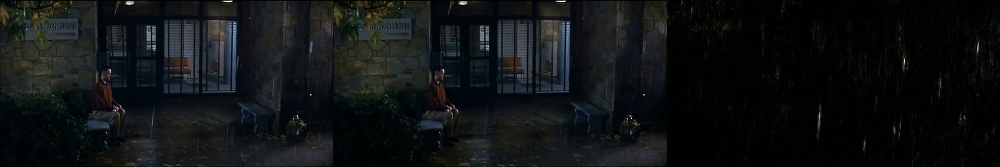
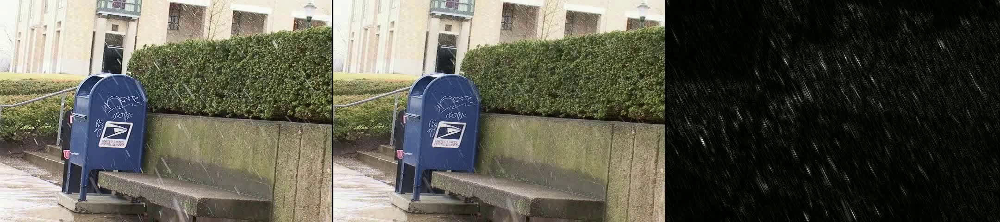

# Rain and Snow Removal From Videos

This code is based on the [research paper by Barnum et al](http://www.cs.cmu.edu/~ILIM/projects/LT/rainAndSnow/rainAndSnow.html).

Please note that this project contains code only for generation, detection, and removal of rain/snow (not for amplifying rain/snow) in videos.

## Code Overview

There are only 2 code files - `src/helper.py` and `src/main.py`.

`src/helper.py` contains code for mathematical operations like FFT and integration.

`src/main.py` contains the algorithm for generation, detection, and removal.

The function and variables names are borrowed from the paper. So, $b$, $\theta$, and $\mu_x$ appear as `b`, `theta`, and `mu_x` in the code.

## Quick Usage

To clean a video

- Run a Python interactive shell
- Import the `process_file` function from `main.py`
- Execute the following

```py
process_file(path_to_input_file>, path_to_output_file, angle_in_radians)
```

This will create 2 videos - one with cleaned sequence, other with detected rain/snow.

For more details, see `src/example.ipynb`.

## Examples

## Rain generation

- 300×200, 60°

  

- 300×200, 90°

  

## Detection and removal

The leftmost image is the original, the middle one is cleaned and the rightmost is the detected rain/snow.





